RA-MAP: Baseline Outlier Detection
================

All analysis was conducted in R version 4.0.0 using the following
script. Computations were performed on a MacBook Pro with 16GB of RAM
and an i7 quad-core processor.

If you haven’t already installed the `bioplotr` package, you’ll need to
do so to reproduce the figures below.

``` r
# Install bioplotr
devtools::install_github('dswatson/bioplotr')

# Load libraries
library(data.table)
library(bioplotr)
```

# Import Data

We begin by loading the microarray and clinical data.

``` r
# Clinical data
clin <- fread('./Data/0m_clinical.csv'
  )[, delta := DAS28.0M - DAS28.6M]

# Remove NAs
clin <- clin[!is.na(delta)]

# Microarray data
y <- readRDS('./Data/microarray_dat.rds')
y <- y[, clin$LIMS_Sample_ID]

# Rename samples for convenience
clin[, s := paste0('s', .I)]
colnames(y) <- clin$s
```

To motivate the idea that some samples appear to be mislabelled by cell
type, we begin with a kernel PCA (kPCA) plot of the dataset, using the
top 10,000 most variable
genes.

``` r
plot_kpca(y, group = list('Cell Type' = clin$CELL.TYPE), pal_group = 'd3', 
          top = 1e4, size = 2, alpha = 0.5)
```

<p align='center'>

</p>

It looks like several samples may be misclassified here. PCA plots by
cell type further confirm this.

``` r
# Define PCA by cell type function
pca_cell <- function(cell) {
  # Subset the data
  clin_tmp <- clin[CELL.TYPE == cell]
  y_tmp <- y[, clin_tmp$s]
  # Plot
  plot_pca(y_tmp, label = TRUE, size = 2, title = cell)
}

# Loop over cell types
sapply(clin[, unique(CELL.TYPE)], pca_cell)
```

<p align='center'>
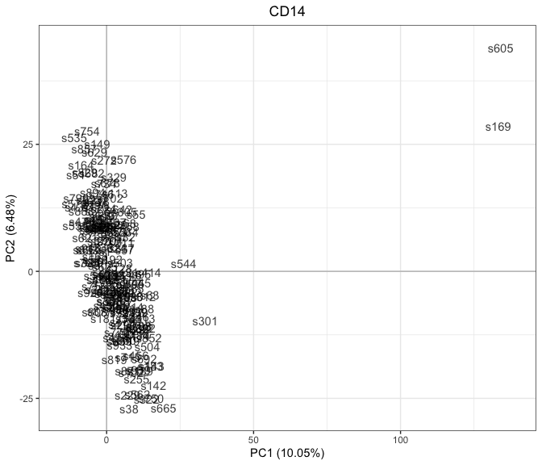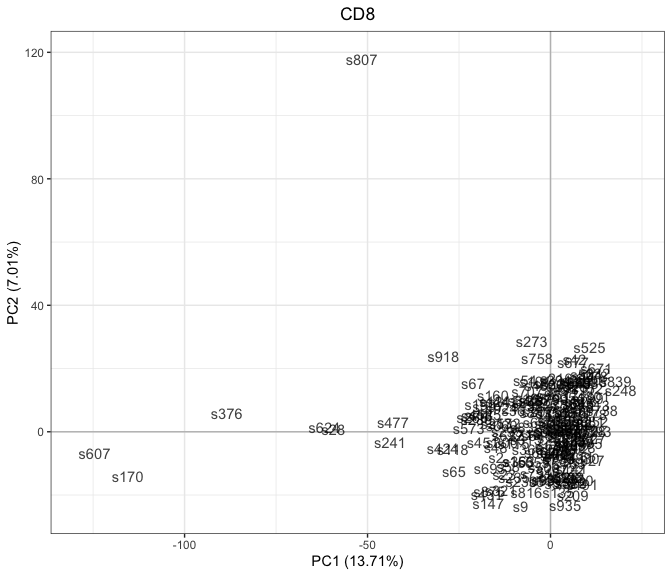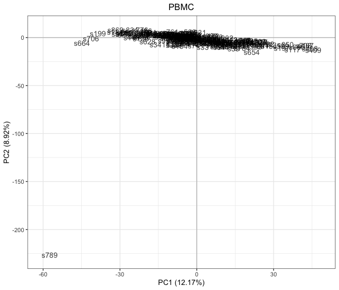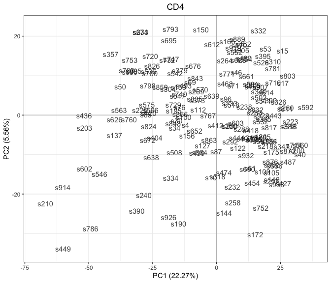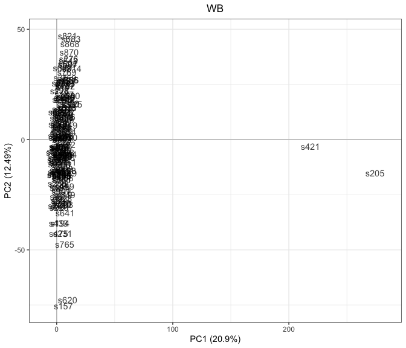
</p>

Fortunately, some of these samples are evident swaps.

``` r
clin[s %in% c('s605', 's172'), CELL.TYPE := 'CD8']
clin[s %in% c('s607', 's170'), CELL.TYPE := 'CD14']
clin[s == 's169', CELL.TYPE := 'CD4']
```

Others are outliers that will have to be removed.

``` r
outliers <- c('s789', 's376', 's807', 's205', 's421')
clin <- clin[!s %in% outliers]
y <- y[, clin$s]
```

We replot by cell type to see the impact of the
change.

``` r
sapply(clin[, unique(CELL.TYPE)], pca_cell)
```

<p align='center'>
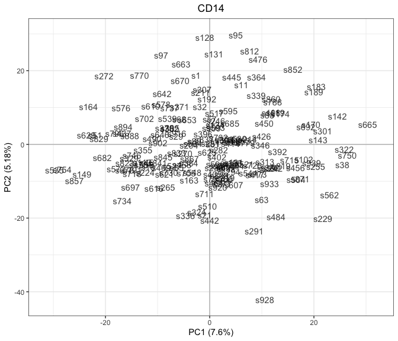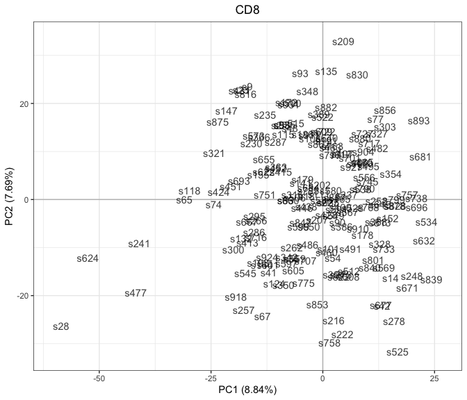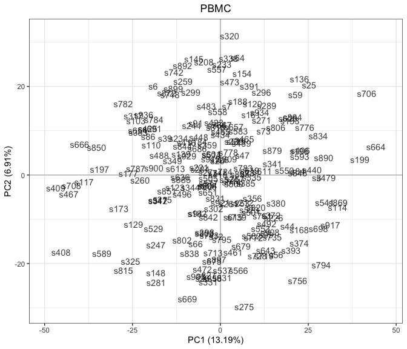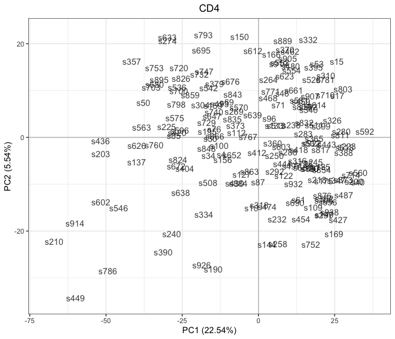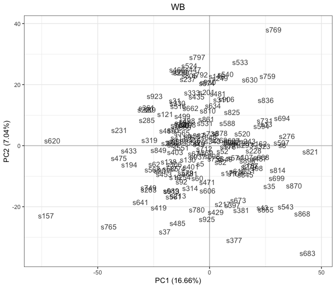
</p>

And all together for a more global
picture.

``` r
plot_kpca(y, group = list('Cell Type' = clin$CELL.TYPE), pal_group = 'd3', 
          top = 1e4, size = 2, alpha = 0.5)
```

<p align='center'>
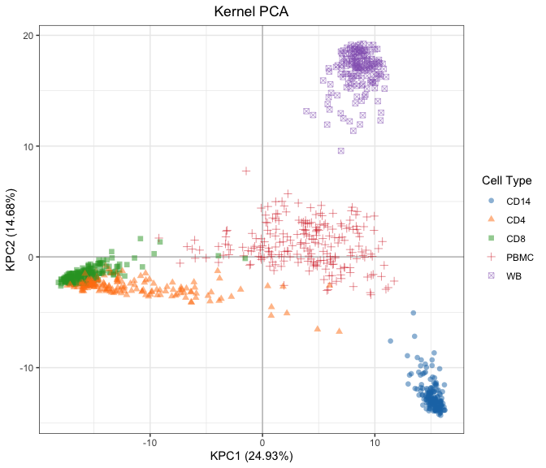
</p>

The data are now ready for downstream analysis.
