RA-MAP: Outlier Detection
================

All analysis was conducted in R version 4.0.0 using the following
script. Computations were performed on a MacBook Pro with 16GB of RAM
and an i7 quad-core processor.

If you haven’t already installed the `bioplotr` package, you’ll need to
do so to reproduce the figures below.

``` r
# Install bioplotr
devtools::install_github('dswatson/bioplotr')

# Load libraries
library(data.table)
library(bioplotr)
```

# Import Data

We begin by loading the microarray and clinical data.

``` r
# Clinical data
clin <- fread('./Data/6m_clinical.csv')

# Touch up clinical data
clin[, delta := DAS28.0M - DAS28.6M
  ][grepl('CD14', SampleTypeName), Cell := 'CD14'
  ][grepl('CD4', SampleTypeName), Cell := 'CD4'
  ][grepl('CD8', SampleTypeName), Cell := 'CD8'
  ][grepl('PBMCs', SampleTypeName), Cell := 'PBMC'
  ][grepl('Tempus', SampleTypeName), Cell := 'WholeBlood']
clin <- clin[!is.na(delta)]
clin[, s := paste0('s', .I)]

# Microarray data
y <- readRDS('./Data/microarray_dat.rds')
y <- y[, clin$sample_ID]
colnames(y) <- clin$s
```

# Grand Scheme

To motivate the idea that some samples appear to be mislabelled by cell
type, we begin with a kernel PCA (kPCA) plot of the dataset, using the
top 10,000 most variable genes.

``` r
plot_kpca(y, group = list('Cell Type' = clin$Cell), pal_group = 'd3', 
          top = 1e4, size = 2, alpha = 0.5)
```

<p align='center'>
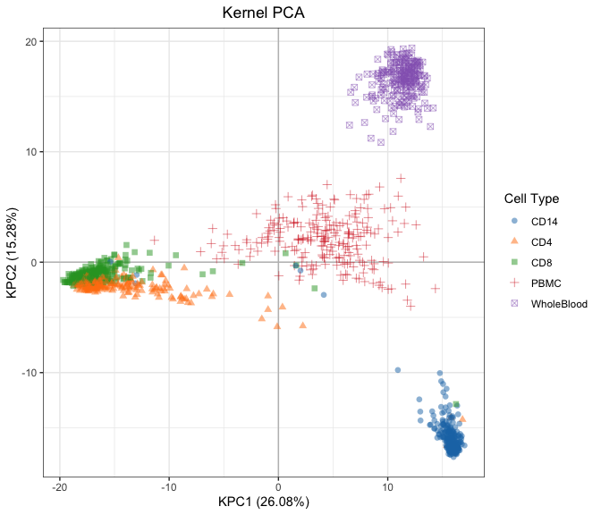
</p>

It looks like several samples may be misclassified here, but there are
no apparent issues with Whole Blood, so we drop this cell type and
replot the data. This time, we examine the first four PCs using kernel
and regular PCA.

``` r
# Subset the data
clin_tmp <- clin[Cell != 'WholeBlood']
y_tmp <- y[, clin_tmp$s]

# Replot: kernel PCA
plot_kpca(y_tmp, group = list('Cell Type' = clin_tmp$Cell), pal_group = 'd3', 
          top = 1e4, size = 2, alpha = 0.5)
```

<p align='center'>
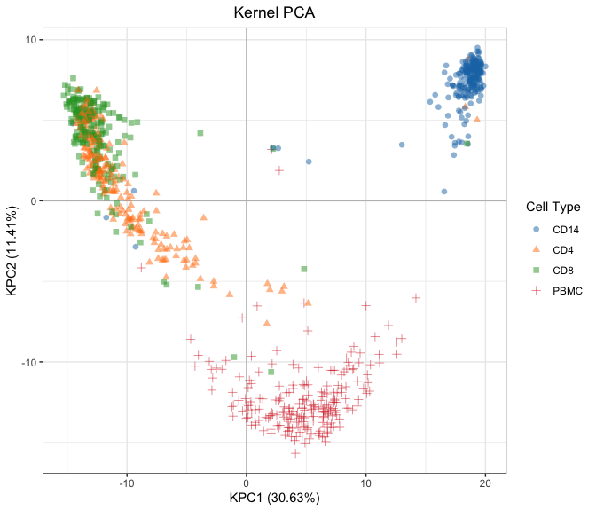
</p>

``` r
plot_kpca(y_tmp, group = list('Cell Type' = clin_tmp$Cell), pal_group = 'd3', 
          top = 1e4, size = 2, alpha = 0.5, dims = c(1, 3))
```

<p align='center'>
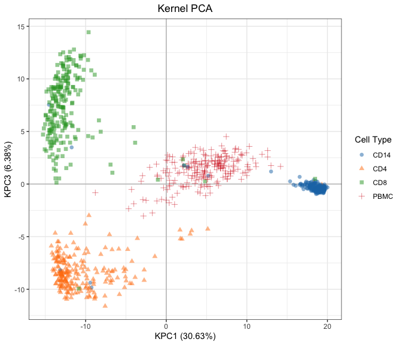
</p>

``` r
plot_kpca(y_tmp, group = list('Cell Type' = clin_tmp$Cell), pal_group = 'd3', 
          top = 1e4, size = 2, alpha = 0.5, dims = c(1, 4))
```

<p align='center'>
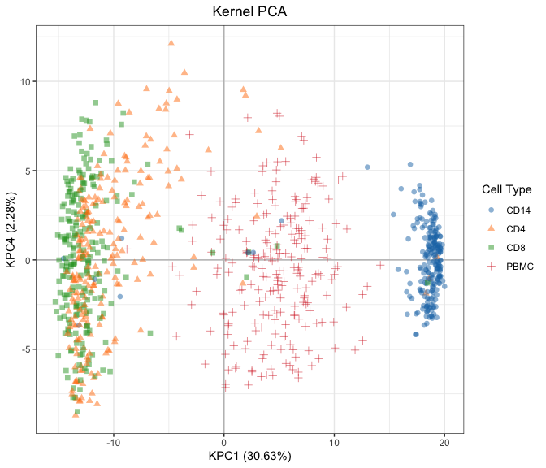
</p>

``` r
# Replot: regular PCA
plot_pca(y_tmp, group = list('Cell Type' = clin_tmp$Cell), pal_group = 'd3', 
         top = 1e4, size = 2, alpha = 0.5)
```

<p align='center'>
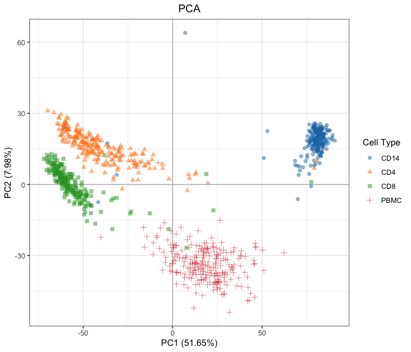
</p>

``` r
plot_pca(y_tmp, group = list('Cell Type' = clin_tmp$Cell), pal_group = 'd3', 
         top = 1e4, size = 2, alpha = 0.5, pcs = c(1, 3))
```

<p align='center'>
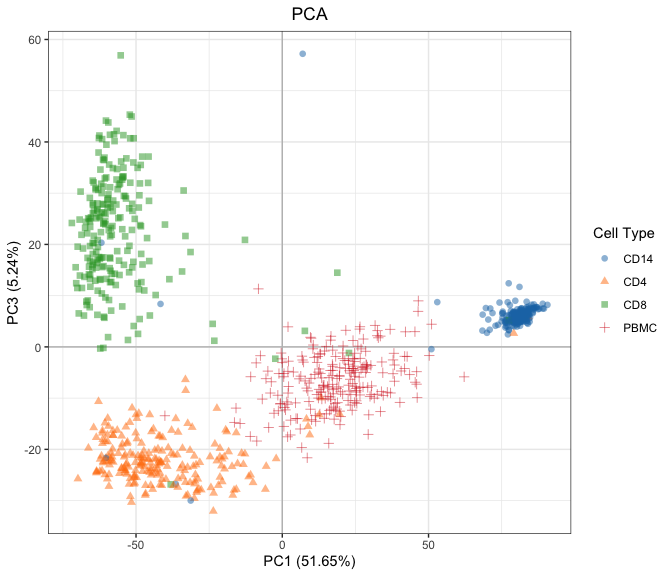
</p>

``` r
plot_pca(y_tmp, group = list('Cell Type' = clin_tmp$Cell), pal_group = 'd3', 
         top = 1e4, size = 2, alpha = 0.5, pcs = c(1, 4))
```

<p align='center'>
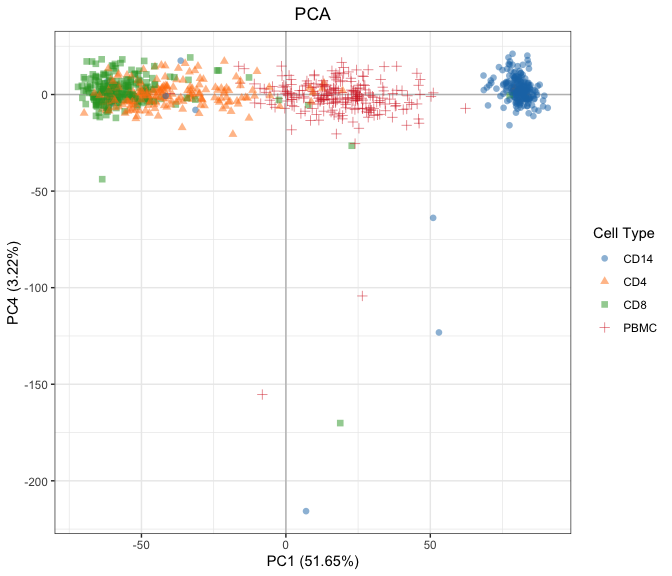
</p>

A few points are immediately apparent from these plots. First, there is
often substantial overlap between CD4 and CD8, which is biologically
plausible. Second, the CD14 cluster appears especially tight, which
makes it all the more evident that a few samples have been mislabelled
here. And third, some samples are far from any cell type cluster,
especially when plotting PC1 vs. PC4.

Close inspection reveals a number of intra-patient swaps that could
explain most of the evident mislabeling. We reclassify these samples and
drop outliers that are far from their corresponding manifold.

``` r
# Swaps
clin[s %in% c('s576', 's267', 's51'), Cell := 'CD4']
clin[s %in% c('s824', 's49', 's107'), Cell := 'CD8']
clin[s %in% c('s574', 's270', 's48', 's826'), Cell := 'CD14']
clin[s == 's108', Cell := 'PBMC']

# Outliers
outliers <- c(
# These samples appear mislabelled, but have no evident intra-patient swaps
  's1', 's440', 's1055', 
# These samples are far from any cell type, indicating technical issues
  's11', 's35', 's200', 's250', 's686', 's1053'
)
clin <- clin[!s %in% outliers]

# Reconfigure
clin_tmp <- clin[Cell != 'WholeBlood']
y_tmp <- y[, clin_tmp$s]

# Replot: kernel PCA
plot_kpca(y_tmp, group = list('Cell Type' = clin_tmp$Cell), pal_group = 'd3', 
          top = 1e4, size = 2, alpha = 0.5)
```

<p align='center'>
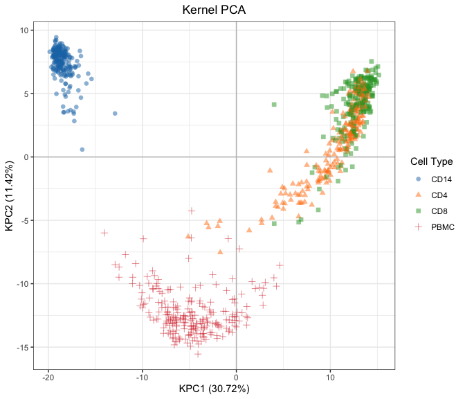
</p>

``` r
plot_kpca(y_tmp, group = list('Cell Type' = clin_tmp$Cell), pal_group = 'd3', 
          top = 1e4, size = 2, alpha = 0.5, dims = c(1, 3))
```

<p align='center'>
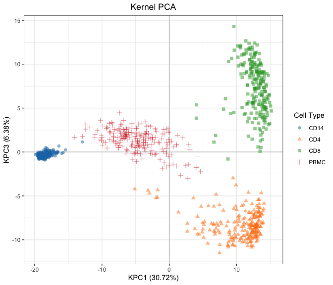
</p>

``` r
plot_kpca(y_tmp, group = list('Cell Type' = clin_tmp$Cell), pal_group = 'd3', 
          top = 1e4, size = 2, alpha = 0.5, dims = c(1, 4))
```

<p align='center'>
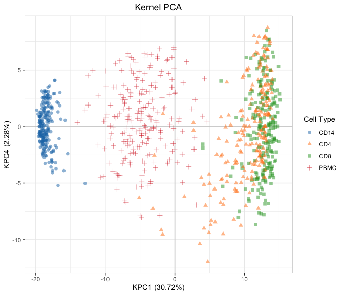
</p>

``` r
# Replot: regular PCA
plot_pca(y_tmp, group = list('Cell Type' = clin_tmp$Cell), pal_group = 'd3', 
         top = 1e4, size = 2, alpha = 0.5)
```

<p align='center'>
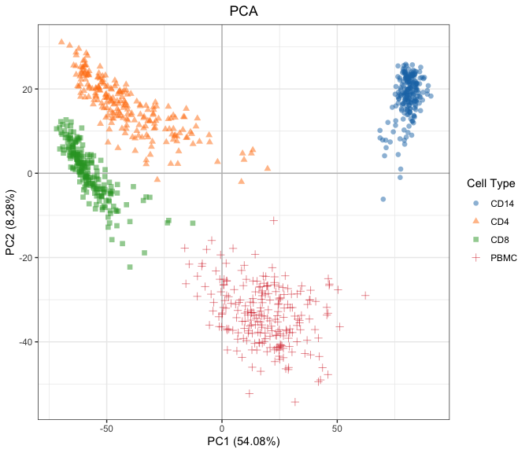
</p>

``` r
plot_pca(y_tmp, group = list('Cell Type' = clin_tmp$Cell), pal_group = 'd3', 
         top = 1e4, size = 2, alpha = 0.5, pcs = c(1, 3))
```

<p align='center'>
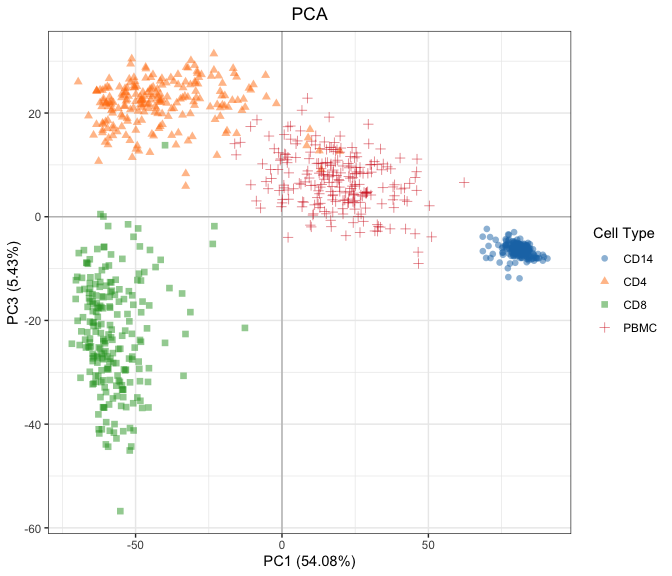
</p>

``` r
plot_pca(y_tmp, group = list('Cell Type' = clin_tmp$Cell), pal_group = 'd3', 
         top = 1e4, size = 2, alpha = 0.5, pcs = c(1, 4))
```

<p align='center'>
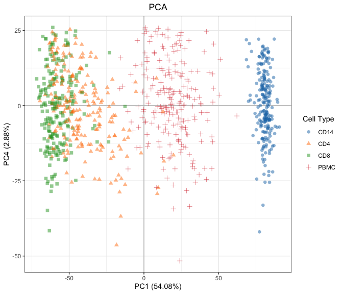
</p>

At this point it’s hard to say whether remaining overlaps are the result
of true outliers or natural variation. In any event, given the
considerable sample size, I think any errors resulting from one or two
mislabelled samples should be washed out.
