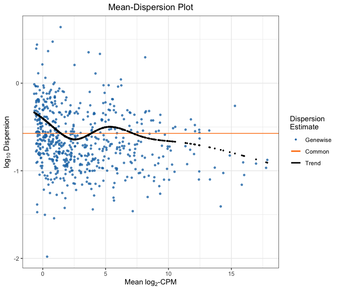
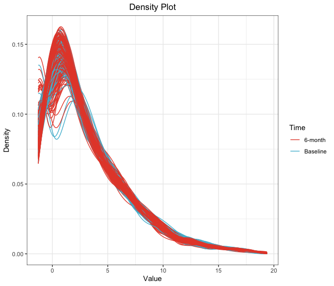
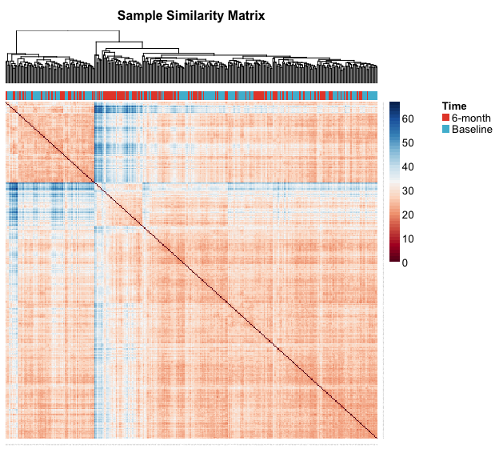
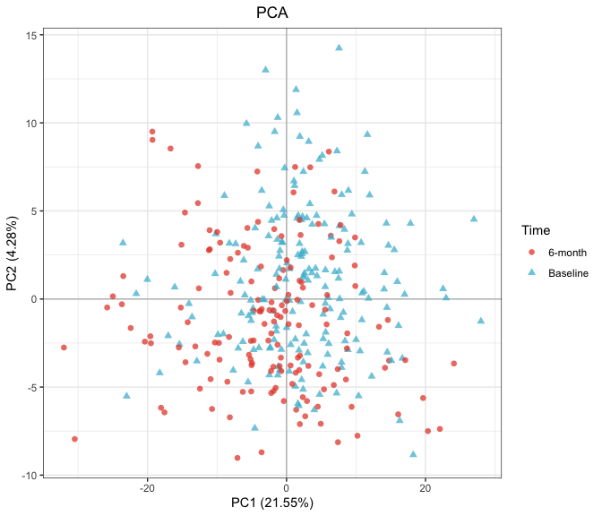
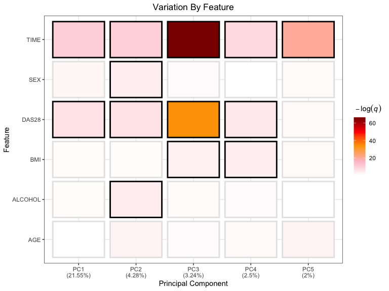

RA-MAP: miRNA EDA
================

-   [Preprocessing](#preprocessing)
-   [Dispersion](#dispersion)
-   [Density Plots](#density-plots)
-   [Subject Similarity Matrix](#subject-similarity-matrix)
-   [Principal Component Analysis](#principal-component-analysis)
-   [Drivers Plot](#drivers-plot)

All analysis was conducted in R version 4.0.3 using the following
script. Computations were performed on a MacBook Pro with 16GB of RAM
and an i7 quad-core processor.

If you haven’t already installed the `bioplotr` package, you’ll need to
do so to reproduce the figures below.

``` r
# Install bioplotr
devtools::install_github('dswatson/bioplotr')

# Load libraries
library(data.table)
library(edgeR)
library(bioplotr)
library(tidyverse)
```

# Preprocessing

We begin by importing the miRNA data and matching it to the clinical
file.

``` r
# miRNA data
y <- readRDS('miRNA_cnts.rds')

# miRNA clinical data
df <- readRDS('miRNA_clinical.rds')

# Clinical data
clin <- fread('clinical_03.03.21.csv') %>%
  select(-Sample_ID) %>%
  rename(Sample_ID = LIMS_Sample_ID)

# Disease activity
clin[, DAS28 := ifelse(TIME == 'Baseline', DAS28.0M, DAS28.6M)]

# Make sample ID column to merge
clin <- merge(clin, df, by = 'Sample_ID')
clin <- unique(clin[, .(Sample_ID, TIME, SEX, AGE, BMI, ALCOHOL, DAS28)])

# Arrange samples
y <- y[, clin$Sample_ID]

# Filter, normalize
n <- ncol(y)
keep <- rowSums(cpm(y) > 1) >= (n/20)   
y <- DGEList(y[keep, ])
y <- calcNormFactors(y)
```

# Dispersion

Count data in omic studies are often presumed to follow a negative
binomial distribution, which may be uniquely identified by its mean and
dispersion parameters. We therefore begin by examining the data’s
mean-dispersion trend, visually inspect for outlying probes.

``` r
plot_dispersion(y)
```

<p align='center'>

</p>

We transform data to the log-CPM scale for further visualization.

``` r
# Transform data
y <- cpm(y, log = TRUE, prior.count = 1)
```

# Density Plots

Next we check the density of all samples to check for outliers.

``` r
plot_density(y, group = list('Time' = clin$TIME))
```

<p align='center'>

</p>

# Subject Similarity Matrix

We build a subject similarity matrix by calculating the [pairwise
Euclidean
distance](https://en.wikipedia.org/wiki/Euclidean_distance_matrix)
between all samples in the data. This matrix can then be visualized as a
heatmap and used to build a [hierarchical
clustering](https://en.wikipedia.org/wiki/Hierarchical_clustering)
dendrogram. We annotate the plot with phenotypic information to see if
the unsupervised clusters track known clinical groupings.

``` r
plot_similarity(y, group = list('Time' = clin$TIME))
```

<p align='center'>

</p>

# Principal Component Analysis

[Principal component analysis
(PCA)](https://en.wikipedia.org/wiki/Principal_component_analysis) is a
popular dimensionality reduction technique. By plotting the samples
along the first two axes of variation, we can check for outliers and
unsupervised clustering effects.

``` r
plot_pca(y, group = list('Time' = clin$TIME), size = 2)
```

<p align='center'>

</p>

# Drivers Plot

Finally, we visualise the relationships between select clinical
variables and the top principal components of the expression matrix as a
heatmap. This plot helps determine top drivers of variation in the miRNA
data.

``` r
# Plot
plot_drivers(y, select(clin, -Sample_ID), p_adj = 'fdr', alpha = 0.05)
```

<p align='center'>

</p>
