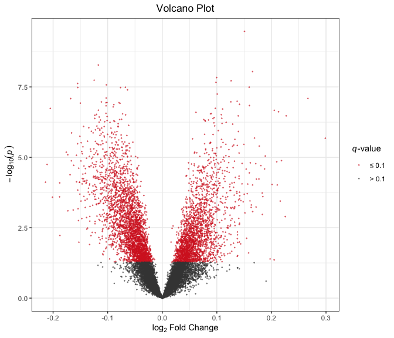
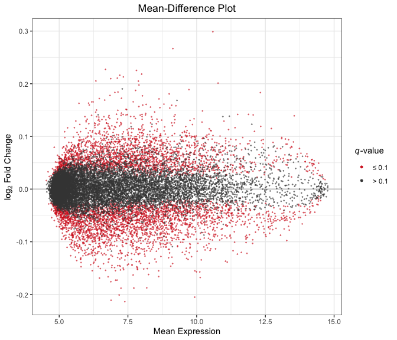

RA-MAP: Differential Expression Analysis
================

All analysis was conducted in R version 4.0.0 using the following
script. Computations were performed on a MacBook Pro with 16GB of RAM
and an i7 quad-core processor.

If you haven’t already installed the `bioplotr` package, you’ll need to
do so to reproduce the figures below.

``` r
# Install bioplotr
devtools::install_github('dswatson/bioplotr')

# Load libraries, register cores
library(data.table)
library(limma)
library(qvalue)
library(bioplotr)
library(tidyverse)
library(doMC)
registerDoMC(8)
```

# Import Data

We begin by loading the microarray and clinical data. For the latter, we
must define percent change in PASI and exponentiate to produce the
transformed outcome variable.

``` r
# Import clinical data, define response
clin <- fread('./Data/clin.csv'
  )[, delta := DAS28.0M - DAS28.6M
  ][, pc := delta / DAS28.0M
  ][, outcome := exp(pc)]

# Import, subset omic data
y <- readRDS('./Data/microarray_dat.rds')
```

# Differential Expression Analysis

To test for differential expression, we fit a series of linear models
with empirical Bayes methods as implemented in the popular `limma`
software package
([Smyth, 2004](http://www.statsci.org/smyth/pubs/ebayes.pdf)). Prior
variance is estimated as a function of expression intensity, as
recommended by Sartor et al.
([2006](https://bmcbioinformatics.biomedcentral.com/articles/10.1186/1471-2105-7-538)).
We estimate the false discovery rate (FDR) using [Storey’s
*q*-values](http://people.eecs.berkeley.edu/~jordan/sail/readings/storey-annals-05.pdf),
a fast and powerful method for measuring [genomewide
significance](http://www.pnas.org/content/100/16/9440.full).

## Response

For the response analysis, we model gene expression as a function of
`outcome` (i.e., exponentiated percent change in PASI), while
controlling for baseline disease activity, log-transformed BMI, and
gender. We use a custom function to loop through all cell-time
combinations in the data.

``` r
# Response analysis
rsp_fn <- function(cell, time) {
  # Subset data
  tmp <- clin[CELL == cell & TIME == time]
  y_tmp <- y[, tmp$Sample_ID]
  # Build model
  des <- model.matrix(~ outcome + DAS28.0M + log(BMI) + GENDER, data = tmp)
  fit <- eBayes(lmFit(y_tmp, des), trend = TRUE)
  # Export results
  saveRDS(fit, paste0('./Results/Model/Response_', time, '_', cell, '.rds'))
  topTable(fit, coef = 2, number = Inf, sort.by = 'none') %>%
    rename(AvgExpr = AveExpr, p.value = P.Value) %>%
    mutate(q.value = qvalue(p.value)$qvalues, Gene = rownames(y)) %>%
    arrange(p.value) %>%
    select(Gene, AvgExpr, logFC, p.value, q.value) %>%
    fwrite(paste0('./Results/Response/', cell, '_', time, 
                  '_Response.txt'), sep = '\t')
}

# Execute in parallel
foreach(x = clin[, unique(CELL)]) %:%
  foreach(y = clin[, unique(TIME)]) %dopar% rsp_fn(x, y)
```

## Disease

For the disease analysis, we use a similar model to above. Gene
expression is regressed on `DAS28` (a common disease activity measure in
RA), controlling for log-transformed BMI and gender. We once again loop
through all cell-time combinations.

``` r
# Disease analysis
das_fn <- function(cell, time) {
  # Subset data
  tmp <- clin[CELL == cell & TIME == time]
  y_tmp <- y[, tmp$Sample_ID]
  # Build model
  des <- model.matrix(~ DAS28 + log(BMI) + GENDER, data = tmp)
  fit <- eBayes(lmFit(y_tmp, des), trend = TRUE)
  # Export results
  saveRDS(fit, paste0('./Results/Model/Disease_', time, '_', cell, '.rds'))
  topTable(fit, coef = 2, number = Inf, sort.by = 'none') %>%
    rename(AvgExpr = AveExpr, p.value = P.Value) %>%
    mutate(q.value = qvalue(p.value)$qvalues, Gene = rownames(y)) %>%
    arrange(p.value) %>%
    select(Gene, AvgExpr, logFC, p.value, q.value) %>%
    fwrite(paste0('./Results/Disease/', cell, '_', time,
                  '_Disease.txt'), sep = '\t')
}

# Execute in parallel
foreach(x = clin[, unique(CELL)]) %:%
  foreach(y = clin[, unique(TIME)]) %dopar% das_fn(x, y)
```

# Results

The code above has produced some 20 results files (5 cell types
\(\times\) 2 time points \(\times\) 2 models). For a brief glance at the
results, we see how many genes are declared differentially expressed at
a 10% FDR threshold.

``` r
expand.grid(
  Cell = clin[, unique(CELL)], 
  Time = clin[, unique(TIME)],
  Model = c('Response', 'Disease')
) %>% rowwise(.) %>%
  mutate(DE_genes = fread(paste0('./Results/', Model, '/', Cell, '_', Time, 
                                     '_', Model, '.txt'))[, sum(q.value <= 0.1)])
```

    ## # A tibble: 20 x 4
    ## # Rowwise: 
    ##    Cell  Time  Model    DE_genes
    ##    <fct> <fct> <fct>       <int>
    ##  1 CD8   6m    Response        0
    ##  2 WB    6m    Response        7
    ##  3 PBMC  6m    Response        0
    ##  4 CD14  6m    Response       71
    ##  5 CD4   6m    Response        0
    ##  6 CD8   0m    Response        0
    ##  7 WB    0m    Response        0
    ##  8 PBMC  0m    Response        0
    ##  9 CD14  0m    Response        0
    ## 10 CD4   0m    Response        0
    ## 11 CD8   6m    Disease         0
    ## 12 WB    6m    Disease      2205
    ## 13 PBMC  6m    Disease        42
    ## 14 CD14  6m    Disease       217
    ## 15 CD4   6m    Disease         1
    ## 16 CD8   0m    Disease       231
    ## 17 WB    0m    Disease      5270
    ## 18 PBMC  0m    Disease      1761
    ## 19 CD14  0m    Disease       839
    ## 20 CD4   0m    Disease        94

These results suggest a stronger disease than response signal, which was
to be expected. However, there are some differentially expressed genes
in the 6-month response analysis, notably in CD14 and whole blood
samples.

For a quick example visualization, we zoom in on the model with the
greatest number of differentially expressed genes, namely the disease
analysis in whole blood, baseline samples.

``` r
# Import data
df <- fread('./Results/Disease/WB_0m_Disease.txt')

# Volcano plot
plot_volcano(df, probes = 'Gene', fdr = 0.1)
```

<p align='center'>

</p>

``` r
# Mean-difference plot
plot_md(df, probes = 'Gene', fdr = 0.1)
```

<p align='center'>

</p>

We see here that there is considerable differential expression
throughout the expression range, although fold changes are generally
modest.
