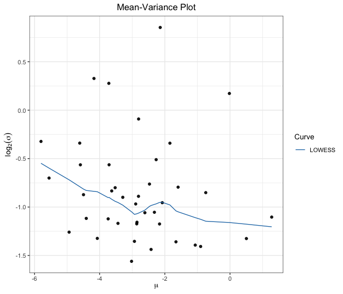
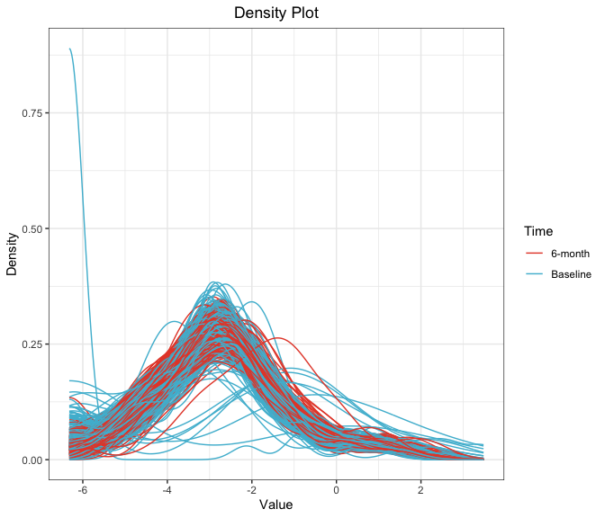
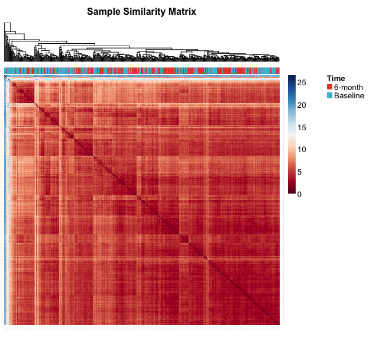
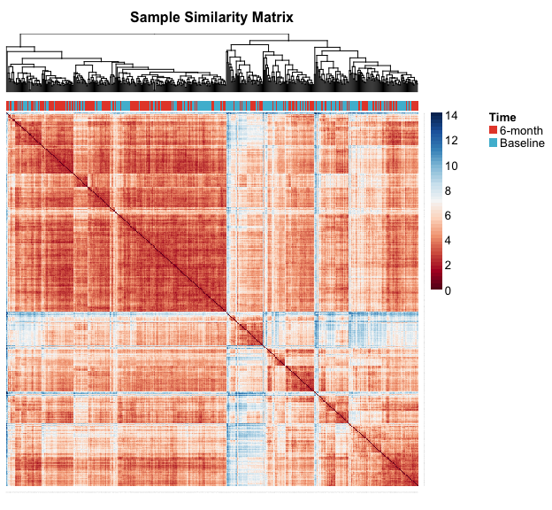
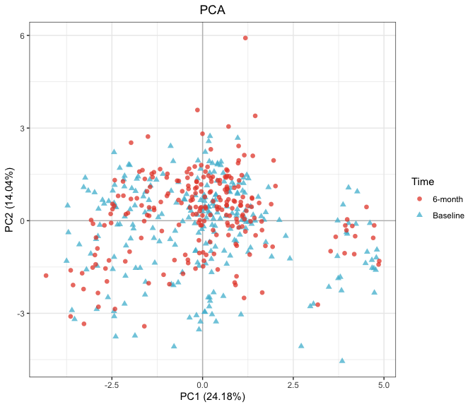
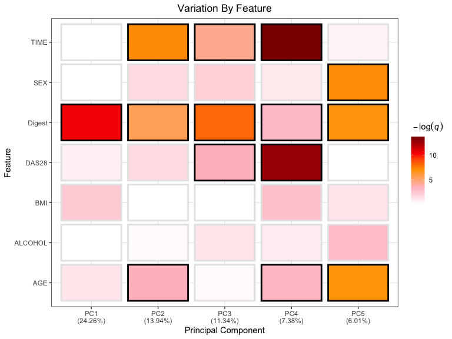

RA-MAP: Serum Metabolomic EDA
================

-   [Preprocessing](#preprocessing)
-   [Mean-Variance](#mean-variance)
-   [Density Plots](#density-plots)
-   [Subject Similarity Matrix](#subject-similarity-matrix)
-   [Principal Component Analysis](#principal-component-analysis)
-   [Drivers Plot](#drivers-plot)

All analysis was conducted in R version 4.0.3 using the following
script. Computations were performed on a MacBook Pro with 16GB of RAM
and an i7 quad-core processor.

If you haven’t already installed the `bioplotr` package, you’ll need to
do so to reproduce the figures below.

``` r
# Install bioplotr
devtools::install_github('dswatson/bioplotr')

# Load libraries
library(data.table)
library(bioplotr)
library(tidyverse)
```

# Preprocessing

We begin by importing the metabolomic data and matching it to the
clinical file.

``` r
# Autoantibody data
y <- readRDS('metabolomics_sera.rds')

# Clinical data
clin <- readRDS('metabolomics_sera_clin.rds')
```

# Mean-Variance

We begin by examining the data’s mean-variance trend. With this plot, we
can examine the relationship between the first two moments of the
transriptomic data and visually inspect for outlying probes.

``` r
plot_mv(y, trans = 'log')
```

<p align='center'>

</p>

There is a clear association between probewise means and variances here.
This information can be leveraged during analysis, for instance by using
an adaptive prior in `limma` rather than the default global prior
([Sartor et al., 2006](https://www.ncbi.nlm.nih.gov/pubmed/17177995)).

# Density Plots

Next we check the density of all samples to check for outliers.

``` r
plot_density(y, group = list('Time' = clin$TIME))
```

<p align='center'>

</p>

There appears to be at least one potential outlier in this data.

# Subject Similarity Matrix

We build a subject similarity matrix by calculating the [pairwise
Euclidean
distance](https://en.wikipedia.org/wiki/Euclidean_distance_matrix)
between all samples in the data. This matrix can then be visualized as a
heatmap and used to build a [hierarchical
clustering](https://en.wikipedia.org/wiki/Hierarchical_clustering)
dendrogram. We annotate the plot with phenotypic information to see if
the unsupervised clusters track known clinical groupings.

``` r
plot_similarity(y, group = list('Time' = clin$TIME))
```

<p align='center'>

</p>

This plot confirms the presence of outliers. We remove those samples
furthest from the data manifold.

``` r
# Find ten most anomalous samples
d <- as.matrix(dist(t(y)))
r <- rowSums(d)
outliers <- names(sort(r, decreasing = TRUE))[1:10]

# Filter
y <- y[, !colnames(y) %in% outliers]
clin <- clin[!s %in% outliers]

# Replot
plot_similarity(y, group = list('Time' = clin$TIME))
```

<p align='center'>

</p>

Much better.

# Principal Component Analysis

[Principal component analysis
(PCA)](https://en.wikipedia.org/wiki/Principal_component_analysis) is a
popular dimensionality reduction technique. By plotting the samples
along the first two axes of variation, we can check for outliers and
unsupervised clustering effects.

``` r
plot_pca(y, group = list('Time' = clin$TIME), size = 2)
```

<p align='center'>

</p>

# Drivers Plot

Finally, we visualise the relationships between select clinical
variables and the top principal components of the expression matrix as a
heatmap. This plot helps determine top drivers of variation in the
metabolomic data.

``` r
# Need to remove NAs for plot
clin <- na.omit(clin)
y <- y[, clin$s]

# Plot
plot_drivers(y, select(clin, -s), p_adj = 'fdr', alpha = 0.05)
```

<p align='center'>

</p>
