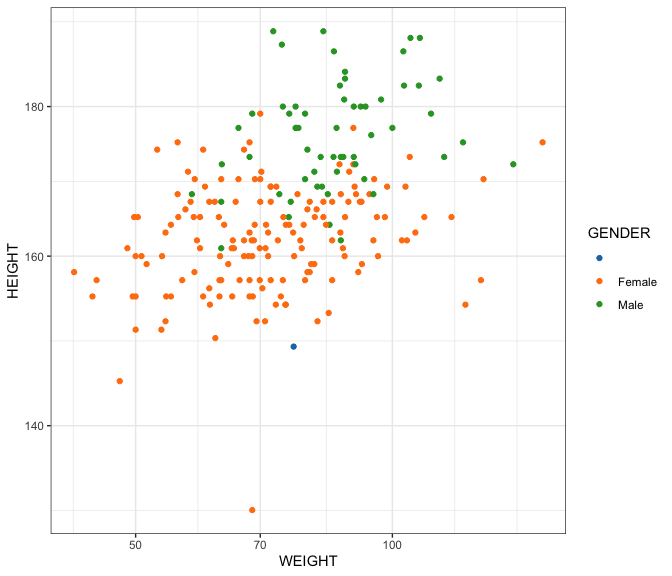
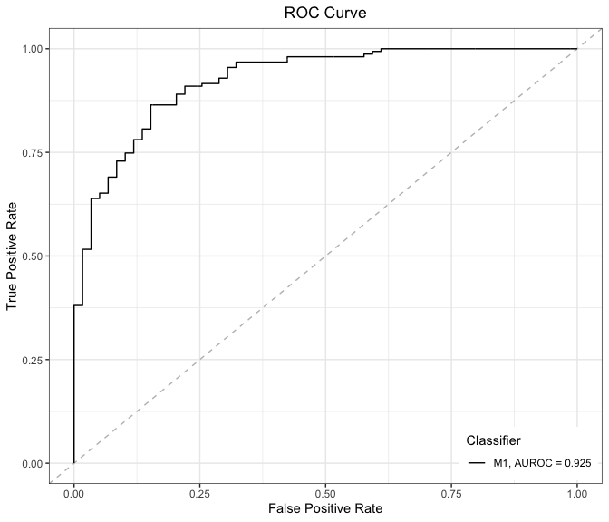
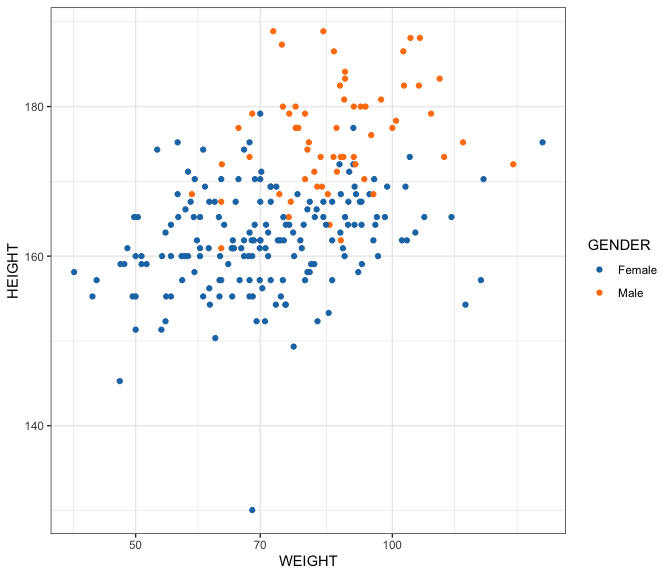

RA-MAP: Imputing Clinical Data
================

All analysis was conducted in R version 4.0.2 using the following
script. Computations were performed on a MacBook Pro with 16GB of RAM
and an i7 quad-core processor.

If you haven’t already installed the `bioplotr` package, you’ll need to
do so to reproduce the figures below.

``` r
# Install bioplotr
devtools::install_github('dswatson/bioplotr')

# Load libraries
library(data.table)
library(bioplotr)
library(splines)
library(tidyverse)
library(ggsci)
```

# Import Data

We begin by loading the clinical data.

``` r
# Clinical data
clin0m <- fread('./Data/0m_clinical_clean_v0.csv')
clin6m <- fread('./Data/6m_clinical_clean_v0.csv')

# Reduce to patient level
df <- clin0m[, .(Patient_ID, HEIGHT, WEIGHT, GENDER)] %>%
  rbind(clin6m[, .(Patient_ID, HEIGHT, WEIGHT, GENDER)]) %>%
  unique(.)

# How many patients?
nrow(df)
```

    ## [1] 237

``` r
# How many missing values?
table(df$GENDER)
```

    ## 
    ##        Female   Male 
    ##      1    175     61

``` r
sum(is.na(df$HEIGHT))
```

    ## [1] 21

We have 237 patients in this dataset. We’re missing `GENDER` data for
one and `HEIGHT` data for 21. Fortunately, these values can be reliably
imputed.

# Gender Model

Gender is well predicted by height and weight, as we can observed in
this scatterplot.

``` r
ggplot(df, aes(WEIGHT, HEIGHT, color = GENDER)) + 
  geom_point() + 
  scale_color_d3() + 
  scale_x_log10() + 
  scale_y_log10() +
  theme_bw()
```

<p align='center'>

</p>

Our extraneous blue point appears to be quite clearly in the female
cluster. A logistic regression bears this out. However, before building
this model, we remove the extremely short patient who may bias results.

``` r
# Recode gender as Boolean
dat <- df %>%
  filter(HEIGHT > min(HEIGHT, na.rm = TRUE), !is.na(HEIGHT), GENDER != '') %>%
  mutate(y = if_else(GENDER == 'Female', 1, 0))

# Fit model
f <- glm(y ~ log(HEIGHT) + log(WEIGHT), data = dat, family = binomial)

# How does the model perform?
plot_roc(dat$y, fitted(f))
```

<p align='center'>

</p>

The model achieves an AUROC of over 0.9, indicating very good fit. We
can now use this model to impute our missing `GENDER` value.

``` r
# Predict our missing point
predict(f, newdata = df[GENDER == ''], type = 'response')
```

    ##         1 
    ## 0.9993331

The model predicts our unrecorded patient is `Female` with 99.9%
probability.

``` r
# Impute gender
df[GENDER == '', GENDER := 'Female']
```

# Height Model

Height is well predicted by weight and gender, as we observed in the
previous scatterplot. We can use that dependency to predict values for
our missing data. First, we evaluate a number of predictive models using
the [Akaike Information Criterion
(AIC)](https://en.wikipedia.org/wiki/Akaike_information_criterion).
Candidate models include splines and interactions.

``` r
# Fit models of variable complexity
f1 <- lm(log(HEIGHT) ~ log(WEIGHT) + GENDER, data = dat)
f2 <- lm(log(HEIGHT) ~ ns(log(WEIGHT), df = 2) + GENDER, data = dat)
f3 <- lm(log(HEIGHT) ~ ns(log(WEIGHT), df = 3) + GENDER, data = dat)
f4 <- lm(log(HEIGHT) ~ log(WEIGHT)*GENDER, data = dat)
f5 <- lm(log(HEIGHT) ~ log(WEIGHT):GENDER, data = dat)
f6 <- lm(log(HEIGHT) ~ ns(log(WEIGHT), df = 2)*GENDER, data = dat)
f7 <- lm(log(HEIGHT) ~ ns(log(WEIGHT), df = 2):GENDER, data = dat)
f8 <- lm(log(HEIGHT) ~ ns(log(WEIGHT), df = 3)*GENDER, data = dat)
f9 <- lm(log(HEIGHT) ~ ns(log(WEIGHT), df = 3):GENDER, data = dat)
f_list <- list(f1, f2, f3, f4, f5, f6, f7, f8, f9)

# Evaluate models
data.frame('Model' = paste0('f', seq_len(9)), 
             'AIC' = sapply(f_list, AIC))
```

    ##   Model       AIC
    ## 1    f1 -785.1740
    ## 2    f2 -783.3956
    ## 3    f3 -781.5284
    ## 4    f4 -783.8929
    ## 5    f5 -785.7787
    ## 6    f6 -781.4597
    ## 7    f7 -783.4562
    ## 8    f8 -778.3552
    ## 9    f9 -780.1560

The minimum AIC is attained by f5, so we use this to impute missing
data.

``` r
# Impute height
df[is.na(HEIGHT), HEIGHT := exp(predict(f5, newdata = df[is.na(HEIGHT)]))]
```

We check a final scatterplot to make sure things look right.

``` r
ggplot(df, aes(WEIGHT, HEIGHT, color = GENDER)) + 
  geom_point() + 
  scale_color_d3() + 
  scale_x_log10() + 
  scale_y_log10() +
  theme_bw()
```

<p align='center'>

</p>

These results look plausible, and now allow us to use BMI in our
downstream DEA models, which is an important predictor of disease
activity in RA.

``` r
# Compute BMI
df[, BMI := WEIGHT / (HEIGHT / 100)^2]

# Write to clinical files
clin0m %>%
  select(-HEIGHT, -GENDER) %>%
  inner_join(df[, .(Patient_ID, HEIGHT, GENDER, BMI)], by = 'Patient_ID') %>%
  fwrite('./Data/0m_clinical_clean.csv')
clin6m %>%
  select(-HEIGHT, -GENDER) %>%
  inner_join(df[, .(Patient_ID, HEIGHT, GENDER, BMI)], by = 'Patient_ID') %>%
  fwrite('./Data/6m_clinical_clean.csv')
```
